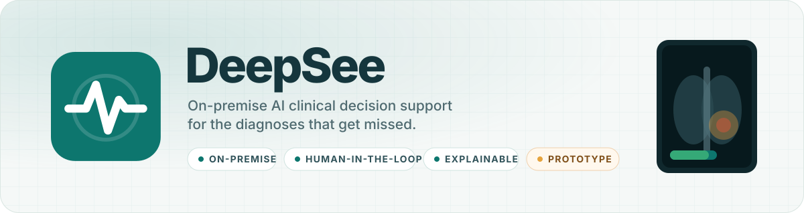
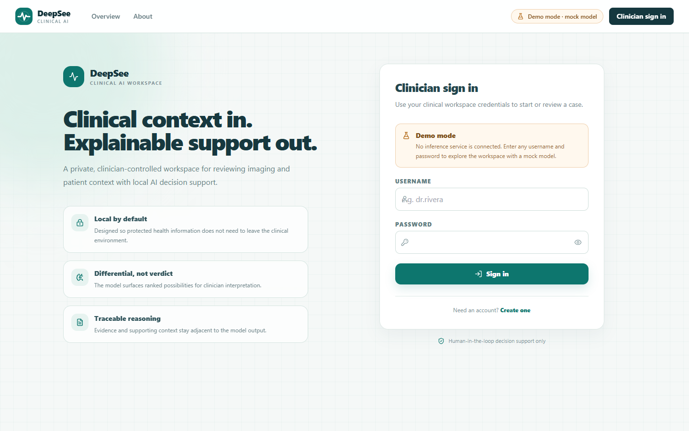
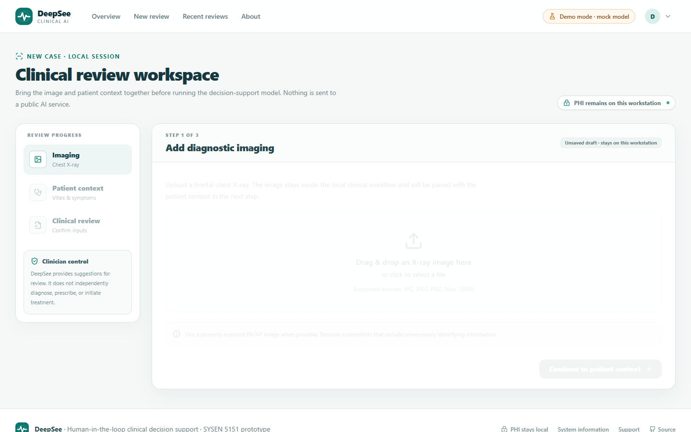
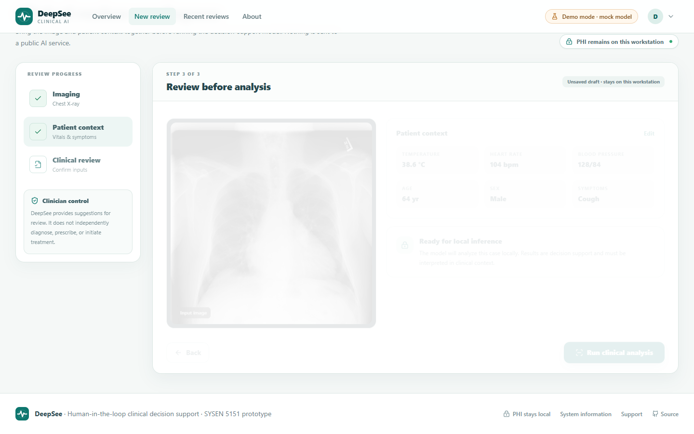
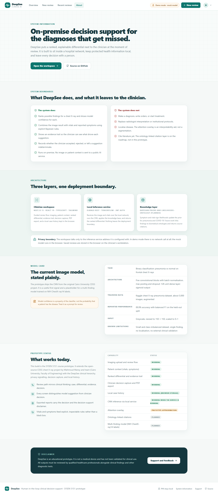
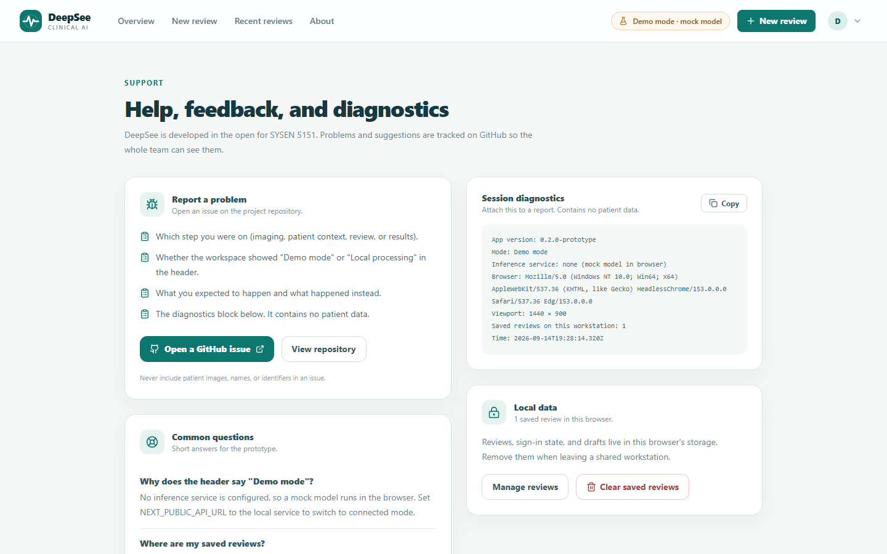
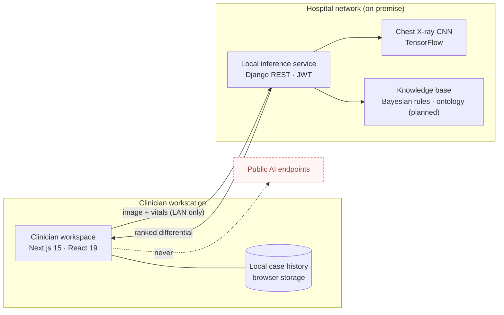
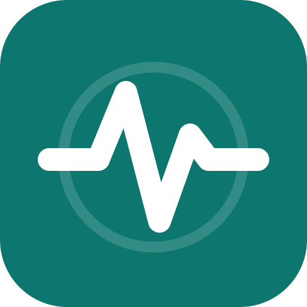

<p align="center">
  <picture>
    <source media="(prefers-color-scheme: dark)" srcset="docs/brand/deepsee-banner-dark.svg">
    
  </picture>
</p>

<p align="center">
  <a href="https://github.com/sysen5151-fall2026/DeepSee/actions/workflows/ci.yml"></a>
  
  
  
  
  
  <a href="LICENSE"></a>
</p>

<p align="center">
  <a href="#quick-start-demo-mode-no-backend">Quick start</a> ·
  <a href="#the-clinician-workflow">Workflow</a> ·
  <a href="#architecture">Architecture</a> ·
  <a href="#model">Model</a> ·
  <a href="#verification">Verification</a> ·
  <a href="#roadmap">Roadmap</a>
</p>

DeepSee puts a ranked, explainable differential beside the clinician at the moment of review. It runs inside the care setting's own network, keeps protected health information local, and leaves every decision with a person.

This repository holds the SYSEN 5151 (Fall 2026) course prototype: a clinician workspace built with Next.js and a local inference service built with Django and TensorFlow. It extends the open-source [CDSS chest X-ray project](docs/ORIGINAL_CDSS_README.md) from Cairo University with the DeepSee clinical hierarchy, privacy signalling, decision capture, and local case history.

> **Disclaimer.** DeepSee is an educational prototype. It is not a medical device and has not been clinically validated. All outputs must be reviewed by qualified healthcare professionals alongside clinical findings and other diagnostic tests.

## Quick start (demo mode, no backend)

```bash
git clone https://github.com/sysen5151-fall2026/DeepSee.git
cd DeepSee/frontend
npm install
npm run dev
```

Open http://localhost:3000, sign in with any username and password, and run a review. Demo mode runs a mock model in the browser and makes no network calls. Sample chest X-rays are in `frontend/assets/x-ray-images/`.

To run against the real CNN, see [Connected mode](#connected-mode-local-inference-service).

## The clinician workflow

Every screen below is captured from the demo-mode prototype by the end-to-end smoke test (`frontend/e2e/smoke.js`).

<table>
  <tr>
    <td width="42%" valign="top">
      <h3>1 · Sign in to a local workspace</h3>
      <p>Authentication happens against the on-premise service, never a public identity provider. The header always states the current mode: <b>Demo mode · mock model</b> or <b>Local processing</b>.</p>
    </td>
    <td width="58%"></td>
  </tr>
  <tr>
    <td valign="top">
      <h3>2 · Bring the case together</h3>
      <p>A three-step rail guides the review: frontal chest X-ray, then patient context (birthdate, sex, temperature, blood pressure, heart rate, cough, headache, smell/taste), then a confirmation view before inference. The image stays on the workstation.</p>
    </td>
    <td>
      
      
    </td>
  </tr>
  <tr>
    <td valign="top">
      <h3>3 · Review before analysis</h3>
      <p>Inputs are summarised side by side with the image so the clinician confirms what the model will see. Nothing runs until <b>Run clinical analysis</b> is pressed.</p>
    </td>
    <td></td>
  </tr>
</table>

### 4 · Case interpretation

The result screen follows clinical hierarchy: a plain-language summary, the ranked differential with model confidence, an attention overlay on the image, an evidence trail that separates model output from clinical input and rule-based refinement, next-step prompts, and a **clinician decision** panel. The citation layer is labelled *not connected* rather than fabricated.

<p align="center"></p>

<table>
  <tr>
    <td width="42%" valign="top">
      <h3>5 · Record the decision, export, reopen</h3>
      <p>Accept, reject, or mark the leading suggestion indeterminate, add a note, and export a PDF that carries the decision and the decision-support disclaimer. Reviews are kept in the browser on the clinician's workstation under <b>Recent reviews</b> and can be reopened with their decision intact.</p>
    </td>
    <td width="58%"></td>
  </tr>
  <tr>
    <td valign="top">
      <h3>Transparency pages</h3>
      <p><b>System information</b> states what DeepSee does and does not do, the architecture, a model card, and a status table for every capability. <b>Support</b> offers session diagnostics with no patient data and a one-click way to clear local reviews on a shared workstation.</p>
    </td>
    <td>
      <a href="docs/screenshots/about.png"></a>
      <a href="docs/screenshots/support.png"></a>
    </td>
  </tr>
</table>

## Connected mode (local inference service)

Requires Python 3.10 to 3.12.

```bash
cd backend
python -m venv .venv && source .venv/bin/activate   # Windows: .venv\Scripts\activate
pip install -r core/requirements.txt
cd core && python manage.py migrate && python manage.py runserver
```

Then, in `frontend/.env.local`:

```
NEXT_PUBLIC_API_URL=http://localhost:8000
```

Register a clinician account from the workspace and start a review. Details: [backend/README.md](backend/README.md).

## Architecture



| Layer | Stack | Responsibility |
| --- | --- | --- |
| Clinician workspace | Next.js 15, React 19, TypeScript, Tailwind | Guided review flow, evidence trail, decision capture, PDF export, local history |
| Local inference service | Django 5.2, DRF, SimpleJWT, TensorFlow 2.19 | Authentication, CNN inference, knowledge-base refinement, ranked differential |
| Knowledge layer | Bayesian priors and likelihoods | Updates pneumonia and COVID-19 probabilities from vitals, symptoms, age, sex |

## Repository layout

```
frontend/   Next.js clinician workspace (see frontend/README.md)
backend/    Django inference service and CNN model (see backend/README.md)
docs/       Brand assets, screenshots, design notes, original project report, dataset README
.github/    CI: frontend typecheck + build, backend syntax check
```

## Model

The current image model is the five-block CNN from the original project, trained on the Kaggle chest X-ray pneumonia dataset (about 5,000 images) with a reported accuracy of 89.9%. It is a binary pneumonia classifier with no localisation output. A multi-finding model on NIH ChestX-ray14 labels is the planned replacement; the dataset README is in `docs/`.

Model confidence is a property of the classifier, not the probability that a patient has the disease. The interface says so wherever a number appears.

## Verification

| Check | Command | Status |
| --- | --- | --- |
| Type check | `cd frontend && npm run typecheck` | Passes |
| Production build | `cd frontend && npm run build` | Passes, 12 routes |
| End-to-end smoke test (demo flow) | `cd frontend && npm run start` then `npm run e2e` | 21 checks pass |
| Backend syntax | `python -m compileall backend/core` | Passes |

The smoke test drives a real browser (installed Edge by default; see `frontend/e2e/smoke.js`) through sign-in, upload, patient context, analysis, decision capture, local history, reopening a case, and sign-out. CI runs the type check, build, and backend syntax check on every push.

## Roadmap

- Ontology-linked evidence retrieval with source citations in the result payload
- Multi-finding classifier (NIH ChestX-ray14) with Grad-CAM attention maps from the model itself
- Server-side case records with audit trail, replacing browser-only history
- DICOM ingestion and PACS integration
- Clinical validation study design

## Brand

<p>
  
  The mark is a vital-sign trace inside a lens on deep teal: <em>seeing the signal</em>. Assets live in <code>docs/brand/</code>: <code>deepsee-mark.svg</code> and <code>deepsee-mark.png</code> (icon), <code>deepsee-logo.svg</code> and <code>deepsee-logo-dark.svg</code> (horizontal lockup), <code>deepsee-banner.svg</code> and <code>deepsee-banner-dark.svg</code> (README header). Colours: teal <code>#0d766e</code>, ink <code>#15363d</code>, surface <code>#f5f8f7</code>, priority amber <code>#e6a33d</code>.
</p>
<br clear="left">

## Design principles

See [docs/UI_DESIGN_NOTES.md](docs/UI_DESIGN_NOTES.md). In short: clinical hierarchy over marketing UI, human-in-the-loop made explicit, privacy made visible, calm medical visual system, and explainability without fabrication.

## License

MIT. See [LICENSE](LICENSE). The original CDSS chest X-ray project is by Mahmoud Mansy and team (Cairo University, Faculty of Engineering).
