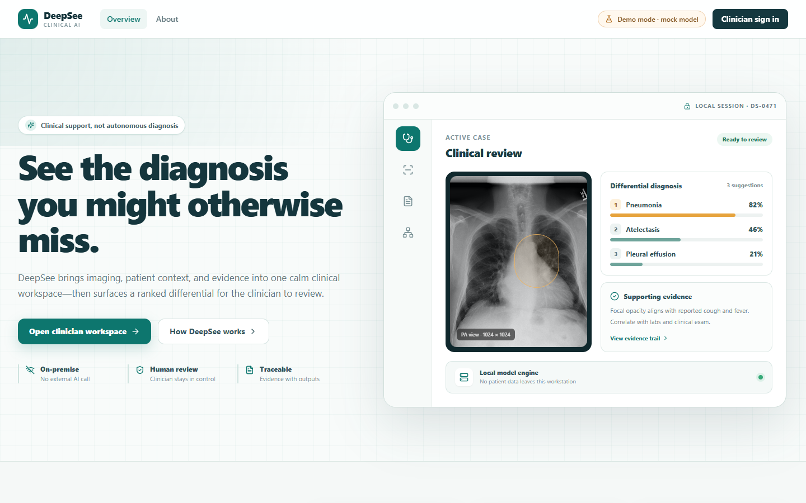
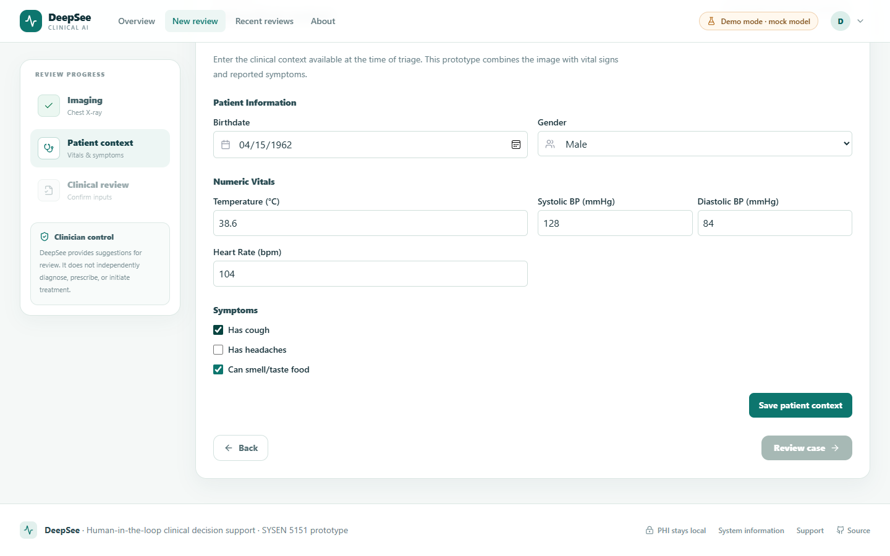
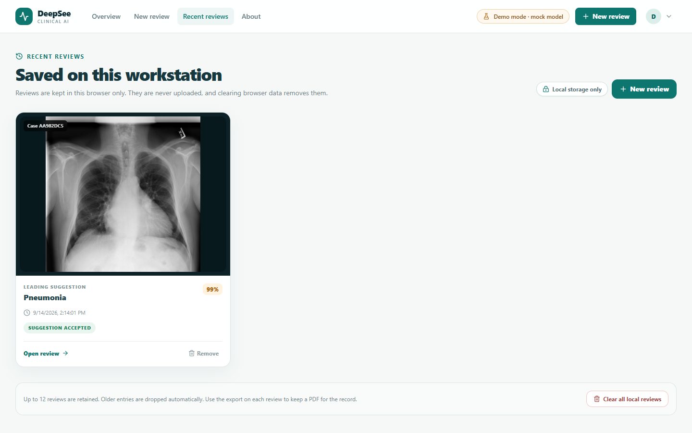
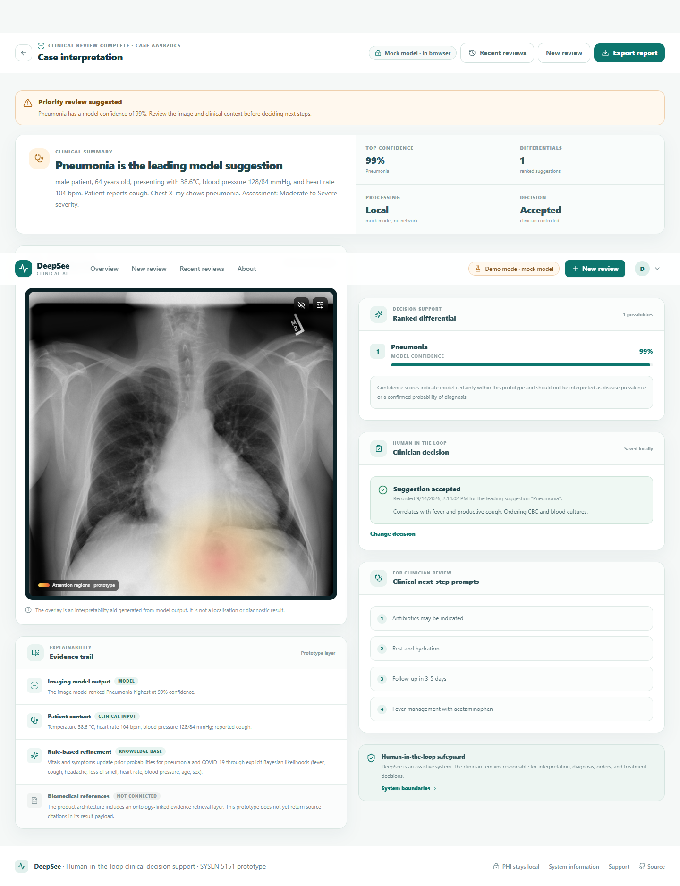
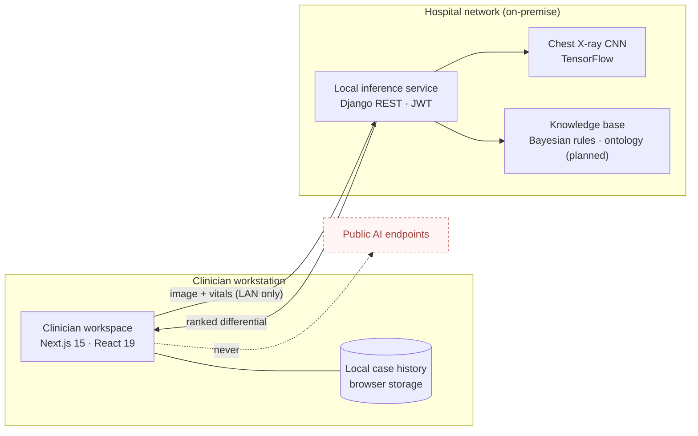

# DeepSee

**On-premise AI clinical decision support for the diagnoses that get missed.**

DeepSee puts a ranked, explainable differential beside the clinician at the moment of review. It runs inside the care setting's own network, keeps protected health information local, and leaves every decision with a person.

This repository holds the SYSEN 5151 (Fall 2026) course prototype: a clinician workspace built with Next.js and a local inference service built with Django and TensorFlow. It extends the open-source [CDSS chest X-ray project](docs/ORIGINAL_CDSS_README.md) from Cairo University with the DeepSee clinical hierarchy, privacy signalling, decision capture, and local case history.

> DeepSee is an educational prototype. It is not a medical device and has not been clinically validated. All outputs must be reviewed by qualified healthcare professionals.

## Screenshots

Captured from the demo-mode prototype by the end-to-end smoke test.

| Overview | Patient context | Recent reviews |
| --- | --- | --- |
|  |  |  |

| Case interpretation (ranked differential, attention overlay, evidence trail, clinician decision) |
| --- |
|  |

More: [sign-in](docs/screenshots/login.png), [imaging step](docs/screenshots/analyze-imaging.png), [review before analysis](docs/screenshots/analyze-review.png), [system information](docs/screenshots/about.png), [support](docs/screenshots/support.png), [register](docs/screenshots/register.png).

## Quick start (demo mode, no backend)

```bash
git clone https://github.com/sysen5151-fall2026/DeepSee.git
cd DeepSee/frontend
npm install
npm run dev
```

Open http://localhost:3000, sign in with any username and password, and run a review. Demo mode runs a mock model in the browser and makes no network calls. Sample chest X-rays are in `frontend/assets/x-ray-images/`.

## Connected mode (local inference service)

Requires Python 3.10 to 3.12.

```bash
cd backend
python -m venv .venv && source .venv/bin/activate   # Windows: .venv\Scripts\activate
pip install -r core/requirements.txt
cd core && python manage.py migrate && python manage.py runserver
```

Then, in `frontend/.env.local`:

```
NEXT_PUBLIC_API_URL=http://localhost:8000
```

Register a clinician account from the workspace and start a review. Details: [backend/README.md](backend/README.md).

## What the prototype does

1. **Bring the case together.** Upload a frontal chest X-ray and enter vitals (temperature, blood pressure, heart rate), demographics, and symptoms.
2. **Review the differential.** See ranked findings with model confidence, an attention overlay on the image, and an evidence trail that separates model output, clinical input, and rule-based refinement. The citation layer is shown as "not connected" rather than fabricated.
3. **Make the clinical call.** Accept, reject, or mark the leading suggestion indeterminate, add a note, and export a PDF that carries the decision and the decision-support disclaimer.
4. **Reopen later.** Reviews are saved to the browser on the clinician's workstation under Recent reviews. Nothing is uploaded.

## Architecture



| Layer | Stack | Responsibility |
| --- | --- | --- |
| Clinician workspace | Next.js 15, React 19, TypeScript, Tailwind | Guided review flow, evidence trail, decision capture, PDF export, local history |
| Local inference service | Django 5.2, DRF, SimpleJWT, TensorFlow 2.19 | Authentication, CNN inference, knowledge-base refinement, ranked differential |
| Knowledge layer | Bayesian priors and likelihoods | Updates pneumonia and COVID-19 probabilities from vitals, symptoms, age, sex |

## Repository layout

```
frontend/   Next.js clinician workspace (see frontend/README.md)
backend/    Django inference service and CNN model (see backend/README.md)
docs/       Design notes, original project report, dataset README, screenshots
.github/    CI: frontend typecheck + build, backend syntax check
```

## Model

The current image model is the five-block CNN from the original project, trained on the Kaggle chest X-ray pneumonia dataset (about 5,000 images) with a reported accuracy of 89.9%. It is a binary pneumonia classifier with no localisation output. A multi-finding model on NIH ChestX-ray14 labels is the planned replacement; the dataset README is in `docs/`.

## Roadmap

- Ontology-linked evidence retrieval with source citations in the result payload
- Multi-finding classifier (NIH ChestX-ray14) with Grad-CAM attention maps from the model itself
- Server-side case records with audit trail, replacing browser-only history
- DICOM ingestion and PACS integration
- Clinical validation study design

## Verification

| Check | Command | Status |
| --- | --- | --- |
| Type check | `cd frontend && npm run typecheck` | Passes |
| Production build | `cd frontend && npm run build` | Passes, 12 routes |
| End-to-end smoke test (demo flow) | `cd frontend && npm run start` then `npm run e2e` | 21 checks pass |
| Backend syntax | `python -m compileall backend/core` | Passes |

The smoke test drives a real browser (installed Edge by default; see `frontend/e2e/smoke.js`) through sign-in, upload, patient context, analysis, decision capture, local history, reopening a case, and sign-out. CI runs the type check, build, and backend syntax check on every push.

## Design principles

See [docs/UI_DESIGN_NOTES.md](docs/UI_DESIGN_NOTES.md). In short: clinical hierarchy over marketing UI, human-in-the-loop made explicit, privacy made visible, calm medical visual system, and explainability without fabrication.

## License

MIT. See [LICENSE](LICENSE). The original CDSS chest X-ray project is by Mahmoud Mansy and team (Cairo University, Faculty of Engineering).
